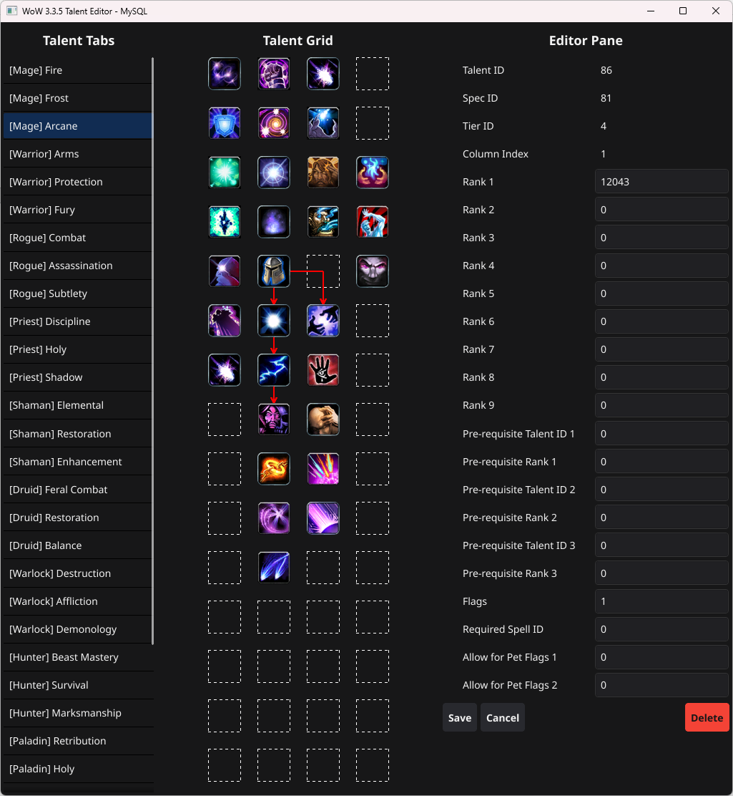

# TalentEditor

**TalentEditor** is a desktop application for editing WoW talents. It provides a visual interface to view, edit, and organize talent trees for classes and pets, directly connected to a MySQL database.

It uses the same database tables as [DBCTool](https://github.com/Foereaper/DBCTool), allowing you to edit talents in TalentEditor and then export them back to `.dbc` files via DBCTool.

---

## Features

* **Visual Talent Grid**: Displays talents in a 4x15 grid per specialization.
* **Talent Editor**: Edit or create talents with a form-based interface.
* **Class & Pet Tabs**: Easily switch between class talent trees and pet talents.
* **Spell Integration**: Displays associated spells with icons and descriptions.
* **Prerequisite Arrows**: Visual connections between talents based on dependencies.
* **DBCTool Integration**: Requires DBC database with DBCTool tables, enabling export to `.dbc` files.
* **Cross-platform GUI**: Built with [Fyne](https://fyne.io/) for Go.
* **Configurable MySQL Backend**: Connects to a MySQL database to read/write talent data.

---

## Screenshots



---

## Installation

If you do not wish to build the editor yourself, you can find a prebuilt binary under the latest Build action.

### Prerequisites

* Go 1.21+
* MySQL database with DBC tables populated (using DBCTool to import)

Required DBC's imported to SQL are as follows:
- ChrClasses
- Spell
- SpellIcon
- Talent
- TalentTab

### Steps

1. Clone the repository:

```bash
git clone https://github.com/Foereaper/TalentEditor.git
cd TalentEditor
```

2. Install dependencies:

```bash
go mod tidy -C src
```

3. Build the application:

```bash
go build -C src -o ../TalentEditor.exe
```

4. Run the application

---

## Configuration

On first run, the application generates a `config.json` template:

```
{
  "dbc": {
    "user": "root",
    "password: "password",
    "host": "127.0.0.1",
    "port": "3306",
    "name": "dbc_db"
  }
}
```

Update the file with your MySQL connection details and restart the application.

---

## Usage

1. Select a class or pet talent tab from the left pane.
2. View the talent grid in the center pane.
3. Click a talent to edit it, or an empty slot to create a new talent.
4. Modify the fields in the editor and click **Save**.
5. Use **Delete** to remove an existing talent.
6. Prerequisites between talents are visualized with arrows.
7. After editing, use [DBCTool](https://github.com/Foereaper/DBCTool) to export the updated talents back to `.dbc` files.

---

## License

This project is licensed under the MIT License. See the [LICENSE](LICENSE) file for details.
